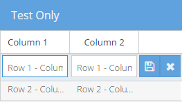

# Action Column Row Editing - An custom ExtJS Plugin
An ExtJS plugin based on Ext.grid.plugin.RowEditing changing the default floating buttons to an action column.

## General Info
This is a custom plugin created as a alternative to default usability provided by Ext.grid.plugin.RowEditing and it is also a workarround to this issue: https://www.sencha.com/forum/showthread.php?337303-Buttons-(Save-and-Cancel)-are-overlapped-by-grid-on-rowediting-plugin

* Demo website: https://maltempi.github.io/extjs-action-column-row-editing/demo/
* Issues: https://github.com/maltempi/extjs-action-column-row-editing/issues
* License: https://github.com/maltempi/extjs-action-column-row-editing/blob/master/LICENSE 
* General rules: Feel free to suggest new ideas, fork it and so on :-)
* Required Version: ExtJS 6.2.0 (actually it wasn't tested on others versions)

## Properties

### hiddenButtons
It hides the default action buttons
If it is false, it will work as the default Ext.grid.plugin.RowEditing.
* Defaults to: true

### buttonsUi
The action buttons ui
* Defaults to: 'default'

### saveButton
It adds a button in a extra action column into grid.
* Accepts: boolean (true show | false hide)| button object (not implemented yet)
* Defaults to: true

### saveButtonIconCls
Save button icon class
* Accepts: string
* Defaults to: 'x-fa fa-check'

### saveButtonToolTip
Save button tool tip
* Accepts: string
* Defaults to: 'Save the edited line'


### cancelButton
It adds a button in a extra action column into grid.
* Accepts: boolean (true show | false hide)| button object (not implemented yet)
* Defaults to: true

### cancelButtonIconCls
The cancel button icon class
* Accepts: string
* Defaults to: 'x-fa fa-times'


### cancelButtonToolTip
* Accepts: string
* Defaults to: 'Cancel'

### hiddenColumnsOnEdit
A list of columns ids to hide on edit.
* Accepts: list string (itemId)
* Defaults to: empty list []

### extraButtons
Sets extra buttons on action column
* Accepts: list of objects
* Defaults to: empty list []

### extraColumns
* Stores the extra columns to hide and show it on events. 
* Defaults to: empty list []

### Example

```javascript

// [Defines the fake data]
var data = [{
    column1: 'Row 1 - Column 1',
    column2: 'Row 1 - Column 2'
}, {
    column1: 'Row 2 - Column 1',
    column2: 'Row 2 - Column 2'
}];

var store = Ext.create('Ext.data.Store', {
    fields: ['column1', 'column2'],
    proxy: {
        type: 'memory',
        reader: {
            type: 'json'
        }
    }
});

store.loadRawData(data, false);
// [/Defines the fake data]

Ext.create('Ext.grid.Panel', {

    renderTo: document.body,

    title: 'Test Only',

    plugins: {
        ptype: 'actionColumnRowEditing',
        hiddenColumnsOnEdit: ['startEditActionColumn'],
        clicksToEdit: 2,
        saveButtonIconCls: 'x-fa fa-floppy-o'
        /*
        Put any other supported configuration here.
        */
    },

    store: store,

    // Define your columns
    columns: [{
        xtype: 'gridcolumn',
        align: 'left',
        dataIndex: 'column1',
        text: 'Column 1',
        editor: 'textfield',
    }, {
        xtype: 'gridcolumn',
        align: 'center',
        editor: 'textfield',
        dataIndex: 'column2',
        text: 'Column 2'
    }, {

        // This column will hide when start to edit.
        xtype: 'actioncolumn',
        width: 50,
        border: false,
        itemId: 'startEditActionColumn',
        align: 'center',
        items: [
            {
                iconCls: 'x-fa fa-pencil-square-o',
                handler: function (grid, rowIndex, colIndex) {
                    grid.editingPlugin.startEdit(rowIndex, 0);
                }
            }
        ]
    }]
});

```

Example result (on editing mode):

